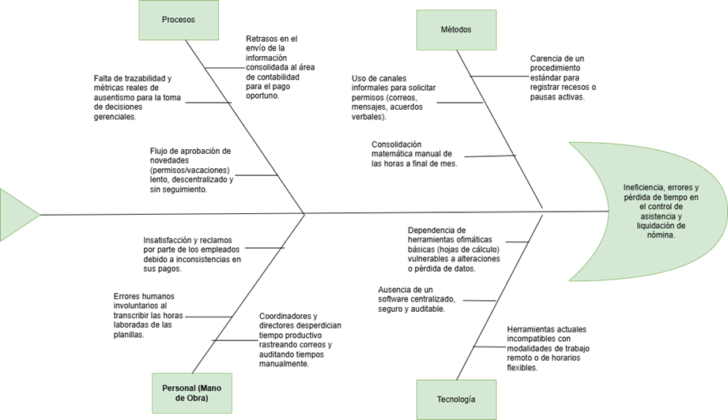

Espina de pescado

Como se evidencia en el Diagrama de Ishikawa, el problema de control de horarios en Virtual Llantas no es un incidente aislado, sino una deficiencia sistémica. Las limitaciones tecnológicas (falta de un software centralizado) obligan a utilizar métodos informales y procesos manuales. Esta cadena de deficiencias recae directamente sobre el personal, provocando errores humanos en la liquidación de nómina y una fuga significativa de tiempo administrativo. Por lo tanto, la implementación del Sistema de Control de Horarios (SCH) propuesto atacará directamente las causas raíz de las categorías de Tecnología y Métodos, estandarizando los Procesos y aliviando la carga operativa del Personal.
